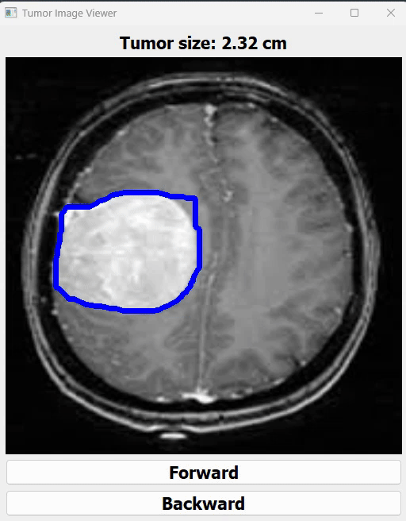

# Tumor Detection using Computer Vision

This project showcases a method to detect tumors in medical images by leveraging computer vision techniques. By narrowing down the tumor region through thresholding and contour detection, the model identifies and highlights the tumor for further analysis.

## Project Overview

The approach used in this project applies image processing techniques to detect tumors without the need for complex machine learning models. It focuses on:

- **Thresholding**: Isolating the area of interest by converting the image into a binary form.
- **Contour Detection**: Identifying the boundaries of the tumor and segmenting it from the rest of the image.

## Features

- **Tumor Localization**: Efficiently detects and marks tumor regions in medical scans.
- **Simple and Effective**: Utilizes fundamental computer vision techniques, making it lightweight and easy to deploy.
- **Customizable**: The parameters for thresholding and contour detection can be adjusted based on different image inputs.

## Getting Started

### Prerequisites

- Python 3.x
- OpenCV (for image processing)
- NumPy
- Qtpy5

You can install the required Python packages using:

## Sample Working GIF


```bash
pip install opencv-python numpy qtp5
